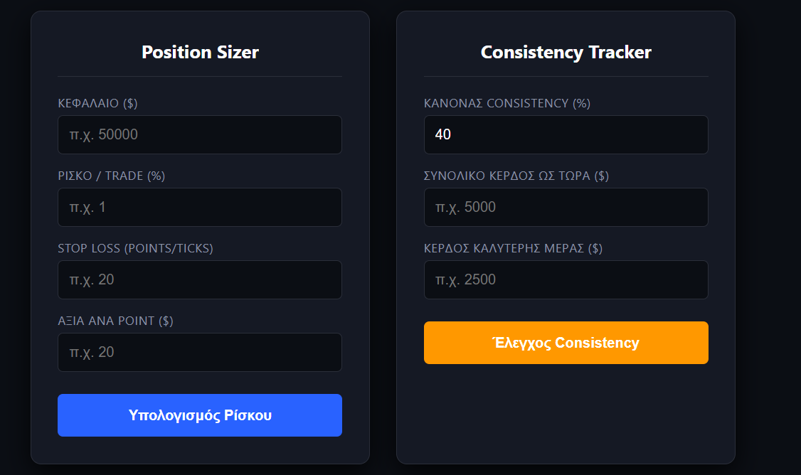

# Prop Firm Risk & Consistency Dashboard 📈

A specialized risk management tool built for algorithmic and manual traders navigating proprietary trading firm evaluations (e.g., Topstep, Apex). It helps traders strictly adhere to Daily Loss Limits and complex Payout Consistency Rules.

## 🎯 The Problem it Solves
Funded traders often lose accounts not because of bad strategies, but due to poor position sizing or violating the "30%/40% consistency rule" during payout requests. This dashboard automates the exact math required to stay compliant.

## 🚀 Key Features
* **Dynamic Position Sizer:** Calculates precise position risk based on account size, tick/point value, and strict stop-loss parameters to prevent Daily Drawdown breaches.
* **Consistency Rule Tracker:** Automatically calculates if your best trading day violates the firm's payout consistency threshold (e.g., 40% rule) and outlines the mathematical requirements to dilute the percentage.
* **Clean UI:** Dark-mode, distraction-free interface designed for quick mid-session calculations.

## 🛠️ Technical Stack
* **Frontend:** HTML, CSS, JavaScript (Real-time DOM manipulation & calculations)

## 👨‍💻 Developer
**ItsDim** - Building tools at the intersection of data, algorithms, and financial markets.
